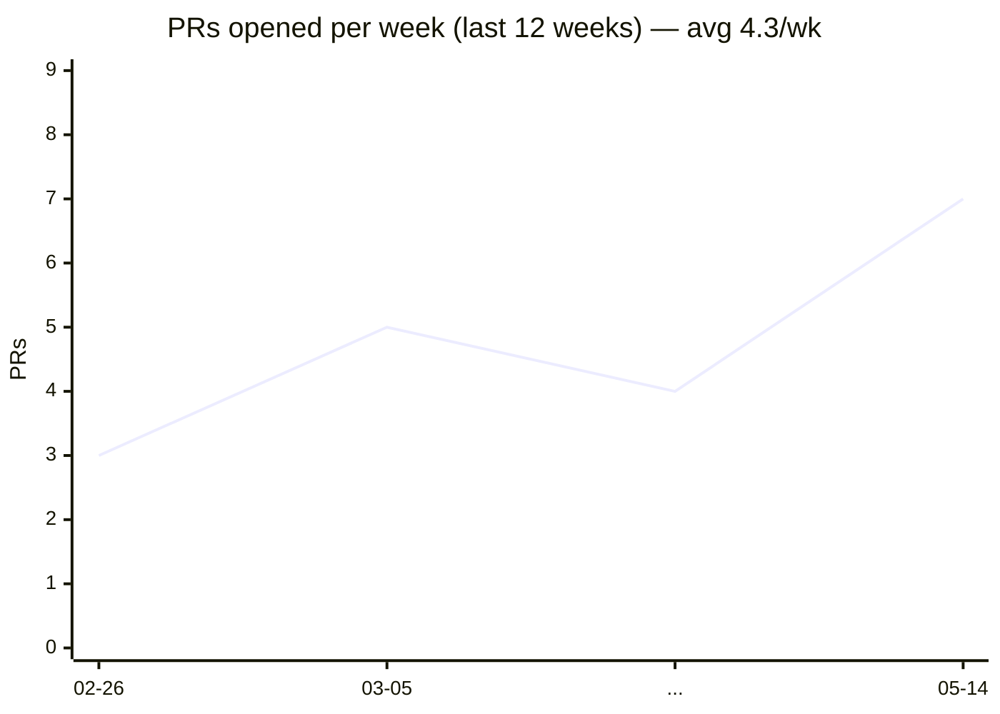

# velocity_chart

A 12-week chart of PRs you've opened per week. Rendered as a Mermaid `xychart-beta` line chart on GitHub; falls back to a Unicode sparkline elsewhere.

## Marker

```
<!--readme-actions:velocity_chart:start-->
<!--readme-actions:velocity_chart:end-->
```

## Output (Mermaid)

````

````

## Output (Unicode fallback)

```
▃▅▄▇▆█▅▃▄▆▅▇
```

## Inputs

| Input | Default | Effect |
|---|---|---|
| `velocity_weeks` | `12` | Number of weeks to plot. |
| `viz_style` | `mermaid` | `mermaid`, `unicode`, or `both`. |
| `repositories` / `exclude_repositories` | _(all)_ | Repo scope. |

## Outputs

| Output | Description |
|---|---|
| `velocity_chart_count` | Total PRs found in the window. |
| `velocity_chart_weeks` | Number of weeks plotted. |
| `velocity_chart_average` | Average PRs per week. |

## Notes

Mermaid `xychart-beta` is rendered natively by GitHub.com markdown. On platforms that don't render Mermaid (Bitbucket, some doc sites), use `viz_style: unicode` or `both`.
